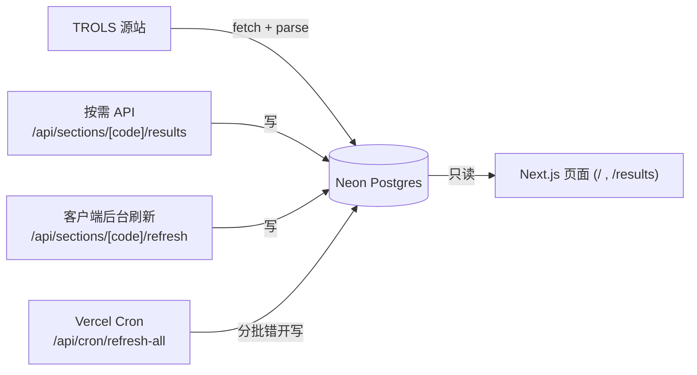

# WDTA Mobile Results

手机友好的 Next.js 网页，用于查看 Waverley Tennis WDTA 周六网球赛的赛果。

WDTA/TROLS 原始赛果页是大量表格，手机上很难看。本应用从 TROLS 抓取对应的
section，缓存到数据库，并以"手机优先"的轮次卡片 / 比赛卡片形式展示。

> **数据与部署细节**：抓取逻辑、三层刷新机制，以及在 **Vercel + Neon 免费档** 上
> 部署 cron 的完整步骤，见 **[docs/data-refresh.md](docs/data-refresh.md)**。

---

## 功能

- Next.js App Router + TypeScript。
- **落地页**：先选 Competition（如 Saturday AM），再选 Section，记住选择，下次直接进入结果页。
- 支持**任意 competition / section**（从 TROLS 动态发现，不再硬编码）。
- 结果页：积分榜（ladder）+ 各轮比赛卡片 + 可折叠的比赛详情（出场名单、rubber、比分）。
- "Original WDTA" 按钮，深链到源站对应 section。
- 切换 section 的图标按钮（清除当前选择，回落地页重选）。
- 缓存超过 2 小时时，打开页面自动在后台刷新数据。
- 页脚 / 头部的 Buy Me a Coffee 捐赠入口。

**不做**：登录、编辑、球队管理、赛果提交。

---

## 架构总览

Neon Postgres 做持久缓存，Vercel 做手机端分发。页面**只读数据库**，渲染时绝不直接
抓取 TROLS（避免 serverless 超时）。



三层刷新：

| 层 | 触发时机 | 端点 | 新鲜度规则 |
|----|---------|------|-----------|
| 按需 | 首次访问未缓存的 section | `GET /api/sections/[code]/results` | 缓存 < 24h 直接用，否则抓取并写库 |
| 后台 | 打开结果页且缓存 > 2h | `GET /api/sections/[code]/refresh` | 服务端 1h 限流 |
| 定时 | Vercel Cron 每日 | `GET /api/cron/refresh-all` | 刷新陈旧 > 12h 的 section，分批错开 |

> 详细的抓取逻辑、健壮性保障（超时 / 限并发 / 单场失败不致命）和 cron 分批策略，
> 见 [docs/data-refresh.md](docs/data-refresh.md)。

---

## 本地开发

安装依赖：

```bash
npm install
```

配置数据库连接（从 Vercel 的 Neon 存储页复制 `.env.local`，或 `vercel env pull .env.local`），
然后建表：

```bash
npm run db:migrate
```

本地运行：

```bash
npm run dev
```

验证：

```bash
npm run typecheck
npm run lint
npm run build
```

---

## 部署（Vercel + Neon 免费档）

简要步骤（完整说明见 [docs/data-refresh.md](docs/data-refresh.md)）：

1. 把仓库推到 GitHub，在 Vercel 导入为 Next.js 项目。
2. Vercel → Storage → 创建 **Neon（Serverless Postgres）**，会自动注入 `POSTGRES_*` 环境变量。
3. 本地 `npm run db:migrate` 建表（生产用的是同一个 Neon 库）。
4. Vercel → Settings → Environment Variables 设置：
   - `CRON_SECRET`（任意随机串，保护 cron 端点）
   - `NEXT_PUBLIC_BUYMEACOFFEE_URL`（可选，捐赠链接）
5. `vercel.json` 已配置每日 cron；部署后在 **项目 → Cron Jobs** 可看到已注册。

**免费档注意**：Vercel Hobby 的 cron 只能每天 1 次、函数上限 60s（所以 cron 用了分批 +
墙钟预算）；Neon 免费档约 0.5GB、闲置自动挂起。

---

## 源数据

源站赛果页：

```txt
https://www.trols.org.au/wdta/results.php
```

各端点（`<comp>` 如 `AA` 表示 Saturday AM，`<code>` 如 `AA016`）：

```txt
GET  results.php                                  → 解析 #daytime 得到所有 competition
POST results.php  which=0&daytime=<comp>          → 解析 #section 得到所有 section
POST results.php  which=1&daytime=<comp>&section=<code>   → 该 section 赛果表
GET  ladders.php?which=1&daytime=<comp>&section=<code>    → 积分榜
GET  match_popup.php?matchid=<id>                 → 单场比赛详情（出场名单 / rubber / 比分）
```

section 列表从竞赛页动态解析；解析失败时回退用 section code 前缀推断 competition。

---

## 缓存数据结构

数据库 `section_cache.results_json` 存的就是下面这个 `CachedResults`（每个 section 一行）：

```ts
type CachedResults = {
  generatedAt: string;
  source: {
    url: string;
    competitionCode: string;
    competitionName: string;
    resultsLoadedAt?: string;
    laddersLoadedAt?: string;
  };
  sections: SectionResults[];
};

type SectionResults = {
  sectionCode: string;
  sectionName: string;
  ladder?: LadderEntry[];
  rounds: RoundResult[];
};

type LadderEntry = {
  rank: number;
  team: string;
  points: number;
  percentage: number;
  venueNote?: string;
  finalsCut?: boolean;
};

type RoundResult = {
  round: number;
  date: string;
  matches: MatchResult[];
};

type MatchResult = {
  matchId?: string;
  status: "played" | "bye" | "washout" | "forfeit" | "unknown";
  homeTeam: string;
  awayTeam: string;
  venueNote?: string;
  home?: TeamScore;
  away?: TeamScore;
  details?: MatchDetails;
};
```

---

## 目录结构

```txt
app/
  page.tsx                      落地页（选 competition / section）
  results/page.tsx              结果页（只读 DB）
  layout.tsx, globals.css
  api/
    competitions/route.ts                       竞赛列表
    competitions/[code]/sections/route.ts       某竞赛的 section 列表
    sections/[code]/results/route.ts            按需抓取 + 缓存
    sections/[code]/refresh/route.ts            强制刷新（1h 限流）
    cron/refresh-all/route.ts                   Vercel Cron 分批刷新
components/
  LandingPage.tsx, ResultsApp.tsx, SectionLoader.tsx
lib/
  db/        index.ts, queries.ts, schema.sql
  wdta/      fetch.ts, parse.ts, types.ts
scripts/
  db-migrate.ts                建表脚本
docs/
  data-refresh.md              数据抓取 + 部署文档
vercel.json                    cron 配置
```

---

## 源站礼仪

源站 `robots.txt` 目前禁止 `/wdta/`。本项目应保持极低流量、激进缓存（按需 24h、cron 12h），
请求加 user-agent、错开发送、限制详情并发。若要面向更广人群发布，请先向 WDTA/TROLS
申请许可或正式数据源。

---

## 参考链接

- WDTA 赛果页：https://www.trols.org.au/wdta/results.php
- Vercel Cron Jobs：https://vercel.com/docs/cron-jobs
- Vercel Cron 用量与价格：https://vercel.com/docs/cron-jobs/usage-and-pricing
- Neon on Vercel：https://vercel.com/docs/storage/vercel-postgres
