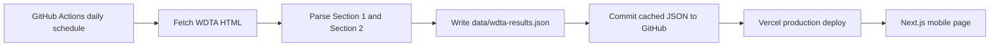

# WDTA Mobile Results

Mobile-friendly Next.js page for Waverley Tennis WDTA Saturday morning Girls S/D Rubbers results.

The original WDTA/TROLS results page is table-heavy and hard to read on a phone. This app fetches the relevant WDTA sections, stores a daily JSON cache, and renders the results as mobile-first round and match cards.

## Status

Implemented MVP:

- Next.js App Router with TypeScript.
- Mobile-first results page with Section 1 / Section 2 tabs.
- Cached match details from WDTA home-team popups, shown in collapsible panels.
- Original WDTA button that deep-links to the selected Saturday AM section on the source site.
- Manual refresh button, enabled only when the visible cache is more than one hour old.
- WDTA fetcher and Cheerio HTML parser.
- JSON cache at `data/wdta-results.json`.
- GitHub Actions daily refresh workflow.
- Vercel-ready build.

External setup still needed:

- Push this repository to GitHub.
- Import the repository into Vercel.
- Confirm scheduled GitHub Actions are enabled on the default branch.

## Current Scope

- Host the site on Vercel.
- Keep the source in GitHub.
- Refresh very infrequently: once per day.
- Cache only these Saturday AM sections for now:
  - `AA016`: Girls S/D Rubbers Section 1
  - `AA017`: Girls S/D Rubbers Section 2
- Display results in a mobile-first layout.
- Do not provide login, editing, team admin, or result submission.

## Source Data

Observed source page:

```txt
https://www.trols.org.au/wdta/results.php
```

The current Saturday morning competition is selected with:

```txt
daytime=AA
```

The section results are fetched by POSTing back to the same PHP page:

```txt
POST https://www.trols.org.au/wdta/results.php
which=1&style=&daytime=AA&section=AA016
which=1&style=&daytime=AA&section=AA017
```

The parser also discovers section IDs from the competition page by visible option text, then falls back to `AA016` and `AA017` if the options cannot be resolved.

Played match rows include IDs such as `AA016041`. Those detail pages are fetched from:

```txt
https://www.trols.org.au/wdta/match_popup.php?matchid=AA016041&seasonid=
```

The cached details include team rosters, emergency markers, rubber combinations, and set scores.

## Architecture

GitHub is the durable cache and Vercel is the mobile delivery layer.



This avoids a database or runtime storage product. If the source site is temporarily unavailable, the deployed app can keep serving the last committed cache.

## Local Development

Install dependencies:

```bash
npm install
```

Refresh the local cache:

```bash
npm run refresh:data
```

Run locally:

```bash
npm run dev
```

Verify the app:

```bash
npm run typecheck
npm run lint
npm run build
```

## Refresh Strategy

The implemented workflow is:

```txt
.github/workflows/refresh-results.yml
```

Schedule:

```yaml
on:
  schedule:
    - cron: "0 20 * * *"
  workflow_dispatch:
```

`20:00 UTC` is around early morning in Melbourne, depending on daylight saving. The workflow installs dependencies, runs `npm run refresh:data`, and commits `data/wdta-results.json` only when the cache changes.

The page also has a manual refresh button. It stays disabled until the currently displayed cache is at least one hour old. The server route at `GET /api/results/refresh` enforces the same one-hour limit and returns `429 Too Many Requests` while the cache is still fresh.

Manual refresh updates the current page from the server response. The daily GitHub Action remains the durable refresh path that commits `data/wdta-results.json` and triggers a Vercel redeploy.

## Vercel Notes

Vercel can also run daily Cron Jobs from `vercel.json`, but that approach needs a durable runtime cache such as Blob/KV or another storage service. For this MVP, GitHub Actions is simpler because the JSON cache is committed to the repository.

If refreshes move into Vercel later, the schedule would look like:

```json
{
  "$schema": "https://openapi.vercel.sh/vercel.json",
  "crons": [
    {
      "path": "/api/cron/refresh",
      "schedule": "0 20 * * *"
    }
  ]
}
```

Vercel Cron schedules use UTC. Vercel's Hobby plan supports daily cron frequency, which matches this project.

## Project Structure

```txt
app/
  page.tsx
  layout.tsx
  globals.css
data/
  wdta-results.json
lib/
  wdta/
    fetch.ts
    parse.ts
    types.ts
public/
  tennis-mark.svg
scripts/
  refresh-wdta-results.ts
.github/
  workflows/
    refresh-results.yml
```

## Cached Data Shape

The cached JSON is explicit and small:

```ts
type CachedResults = {
  generatedAt: string;
  source: {
    url: string;
    competitionCode: string;
    competitionName: string;
    resultsLoadedAt?: string;
  };
  sections: SectionResults[];
};

type SectionResults = {
  sectionCode: string;
  sectionName: string;
  rounds: RoundResult[];
};

type RoundResult = {
  round: number;
  date: string;
  matches: MatchResult[];
};

type MatchResult = {
  matchId?: string;
  status: "played" | "bye" | "washout" | "forfeit" | "unknown";
  homeTeam: string;
  awayTeam: string;
  venueNote?: string;
  home?: TeamScore;
  away?: TeamScore;
  details?: MatchDetails;
};
```

## Deployment

1. Push this repository to GitHub.
2. Import the GitHub repository into Vercel as a Next.js project.
3. Keep the default build command:

```bash
npm run build
```

4. After the first production deploy, the GitHub Action can refresh `data/wdta-results.json` daily and push cache updates.
5. Vercel will redeploy when the cache commit lands.

## Source Etiquette

The source site's `robots.txt` currently disallows `/wdta/`. This project should stay extremely low traffic and cache aggressively. If the page is published for a wider audience, ask WDTA/TROLS for permission or an official data feed.

The daily fetch identifies itself with a user agent and avoids retries that would hammer the source site.

## Useful References

- WDTA results page: https://www.trols.org.au/wdta/results.php
- Vercel Cron Jobs: https://vercel.com/docs/cron-jobs
- Vercel Cron usage and pricing: https://vercel.com/docs/cron-jobs/usage-and-pricing
- Vercel Cron quickstart: https://vercel.com/docs/cron-jobs/quickstart
